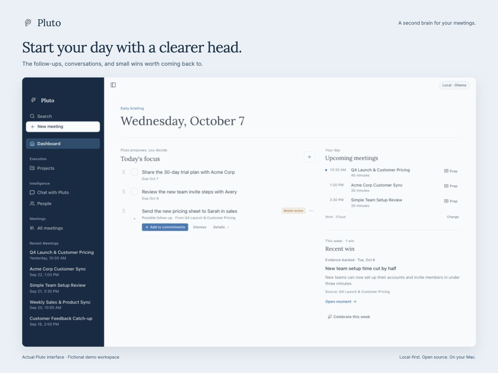
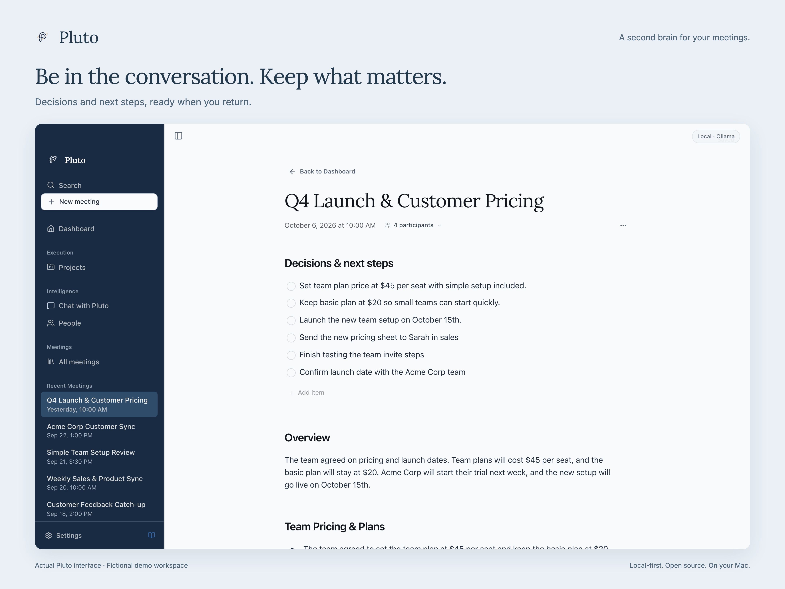
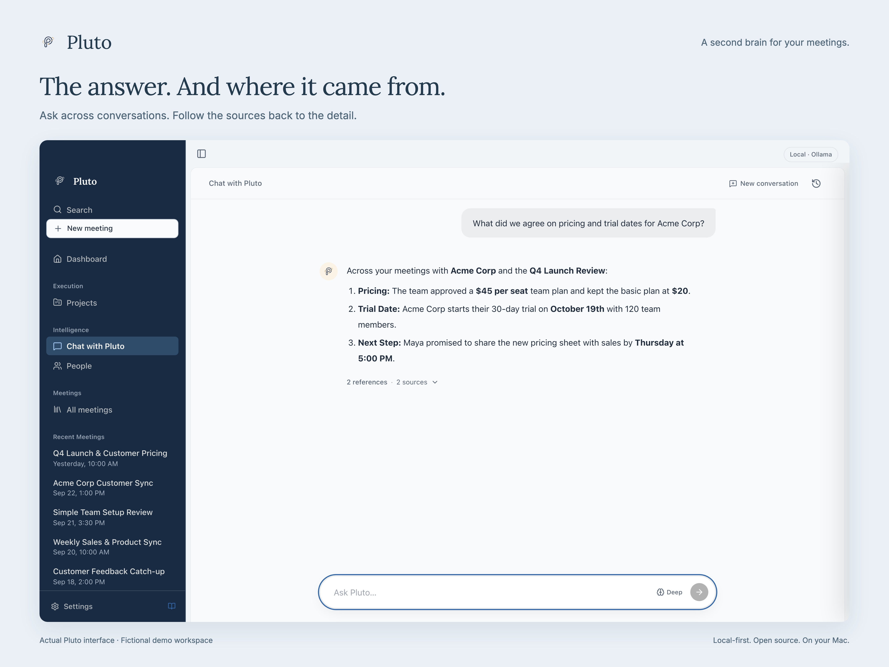
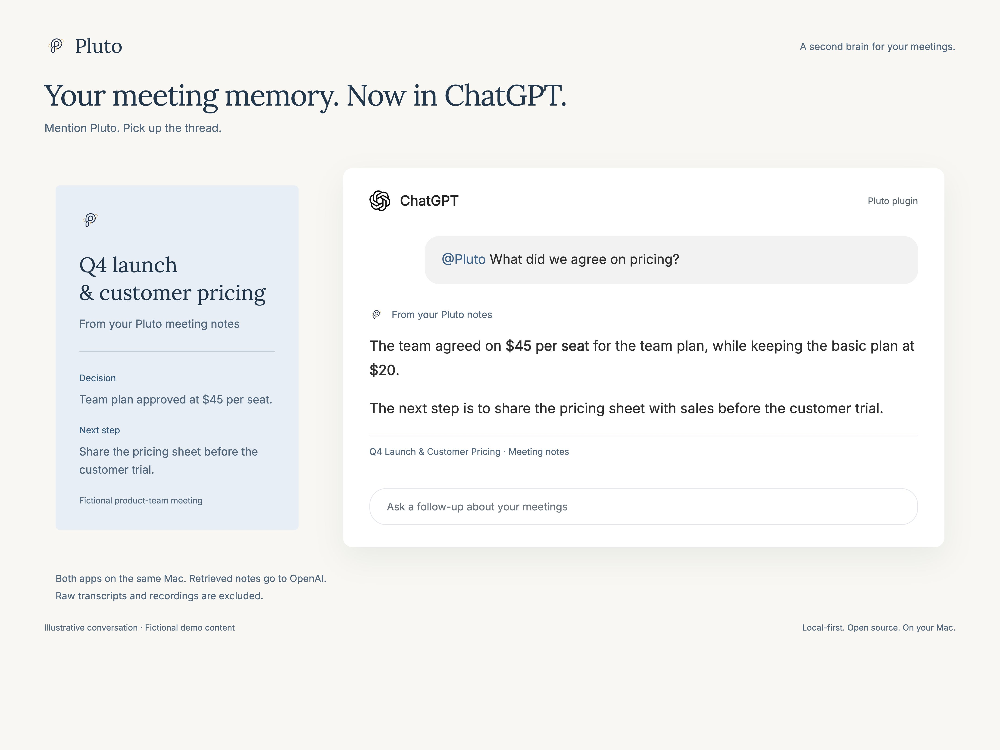
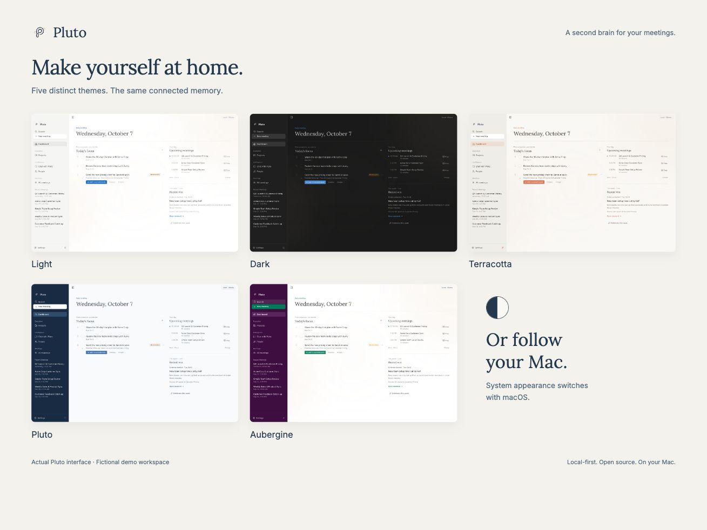

<p align="center">
  
</p>

<h1 align="center">Pluto</h1>

<p align="center"><strong>Be in the conversation. Keep what matters.</strong></p>
<p align="center">A local-first, open-source meeting assistant for Apple Silicon Macs.</p>

<p align="center">
  <a href="#get-started">Get Pluto</a> ·
  <a href="#privacy">Privacy</a> ·
  <a href="docs/getting-started.md">Setup guide</a> ·
  <a href="https://github.com/metagrover/pluto/releases">Releases</a>
</p>

Pluto records meetings without a bot, transcribes on your Mac, and connects
conversations into a working memory of people, projects, and follow-ups.



*Your meetings, commitments, and recent wins in one place. Screenshots use fictional demo data.*

## Get started

You’ll need an **Apple Silicon Mac (M1 or later)** with **macOS 14.2 or later**.

### 1. Install Pluto

Open Terminal, paste this command, and press Return:

```sh
curl -fsSL https://raw.githubusercontent.com/metagrover/pluto/master/scripts/install-macos.sh | bash
```

Pluto installs and opens. Follow setup to choose your storage options, download
speech models, and allow microphone and system audio access.

### 2. Set up local AI

[Download Ollama for Mac](https://ollama.com/download/mac), open it, and complete
its command-line setup. Then run these commands in Terminal to download the
models for meeting notes and chat:

```sh
ollama pull gemma4:12b
ollama pull phi4-mini:3.8b
```

Keep Ollama running. In Pluto’s **Settings → Intelligence**, use **Ollama** with
**Gemma 4 12B** for analysis and **Phi-4 Mini** for fast chat—the defaults for new
setups. These are separate from the speech models downloaded during setup.

Prefer a cloud provider? Choose one in **Settings → Intelligence** and add your
API key instead of setting up Ollama.

### 3. Try your first meeting

Click **New meeting**, record a short conversation, and stop when you’re done.
Once processing finishes, review the notes and next steps, then ask a question
about the conversation. Let participants know when you record.

[Full setup guide and troubleshooting →](docs/getting-started.md) ·
[Download a DMG instead →](https://github.com/metagrover/pluto/releases)

## From conversation to context

Start with a meeting. Return to the decisions, connect them to earlier
conversations, and carry that context into whatever comes next.

### Keep the decisions, not just the recording

Review notes and next steps. Confirm familiar speakers with Voice ID, and follow
People and Projects across conversations.



### Ask. Then check the source.

Ask about your meeting history and follow the references back to the conversation.



### Pick up the thread in ChatGPT

The optional Pluto plugin brings meeting notes into ChatGPT on the same Mac.
[Connect ChatGPT →](docs/chatgpt-connection.md)



*The ChatGPT conversation above is illustrative.*

### Make yourself at home

Choose Light, Dark, Terracotta, Pluto, Aubergine, or follow your Mac’s appearance.



## Privacy

- **Your recordings and transcripts stay on your Mac** when you use local
  intelligence. Cloud AI is optional and sends relevant text to your chosen provider.
- **Database encryption is optional at setup.** Audio files are not encrypted
  by default. [Storage details →](docs/getting-started.md#privacy-and-data)
- **ChatGPT access is optional.** Enabling it makes all meeting notes available
  to read. Retrieved notes go to OpenAI; raw transcripts and audio are excluded.
  Disabling stops future reads; notes already shared remain in ChatGPT.

Let people know when you record. Generated notes, answers, and speaker matches
can be wrong—review the source when it matters.

## Build and contribute

See the [developer guide](docs/dev.md) to run Pluto from source and the
[architecture overview](docs/architecture.md) to explore the codebase.
Bug reports and focused pull requests are welcome. **Help → Report a Problem**
in Pluto prepares a reviewable report; keep private meeting content out of public issues.

## License

[MIT](LICENSE). Third-party code, fonts, and models retain their own licenses:
[FluidAudio](native/parakeet-runtime/vendor/FluidAudio/LICENSE),
[transcription notices](resources/model-manifests/FluidAudio-NOTICE.txt),
[model manifest](resources/model-manifests/parakeet-tdt-0.6b-v3.json),
[Inter](src/assets/fonts/pluto-site/Inter-LICENSE.txt), and
[Lora](src/assets/fonts/pluto-site/Lora-LICENSE.txt).
