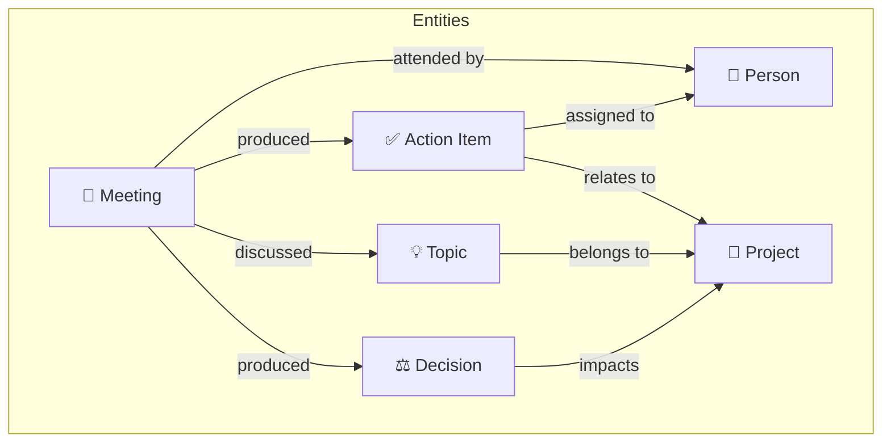

# Technical Design Document (TDD): Pluto

**Project:** Local-First Second Brain for Work

**Vision:** A proactive knowledge system that accumulates context from meetings, surfaces connections, and keeps you accountable.

**Stack:** Electron, React, WhisperX (Python), Configurable LLM, SQLite Knowledge Graph

**Status:** In Development (Sprint 1)

---

## 1. System Architecture

Pluto follows the standard Electron **Multi-Process Architecture**, with Python sidecars for AI processing.

### 1.1 Process Model

* **Main Process (Node.js):** Handles system-level tasks: window management, global shortcuts, filesystem access, and spawning the WhisperX Python server.
* **Renderer Process (React/Vite):** Handles the UI, state management for transcripts, and user interactions.
* **Preload Script:** Acts as a secure bridge (Context Bridge) between the Main and Renderer processes.
* **WhisperX Sidecar:** A Python HTTP server that wraps WhisperX for transcription + speaker diarization.
* **LLM Backend:** Pluggable architecture supporting local (Ollama) and cloud (Gemini/OpenAI/Claude) providers.

---

## 2. Technical Stack

| Layer | Technology | Implementation Detail |
| --- | --- | --- |
| **Shell** | **Electron** | Primary desktop wrapper. |
| **UI Framework** | **React + Tailwind** | For a modern, responsive dashboard. |
| **Audio Routing** | **electron-audio-loopback** | Chromium-native loopback for system audio capture. |
| **STT Engine** | **WhisperX** | Python-based Whisper with speaker diarization via pyannote. |
| **LLM** | **Configurable** | Default: Ollama (local). Optional: Gemini, OpenAI, Claude. |
| **Storage** | **Better-SQLite3** | Local relational database with FTS5 for search. |
| **IPC** | **Electron IPC** | For communication between UI and the Audio/AI logic. |

---

## 3. Module Specifications

### 3.1 Audio Capture Module

To capture meeting audio (Zoom/Google Meet) without virtual drivers:

* **System Audio:** `electron-audio-loopback` enables Chromium's hidden loopback flags, then `getDisplayMedia` captures system audio.
* **Microphone:** Standard `getUserMedia` for local mic input.
* **Mixing:** Both streams mixed via `AudioContext` → `MediaStreamDestination`.
* **Output:** WebM recorded via `MediaRecorder`, converted to WAV (16-bit, 16kHz) via FFmpeg.

### 3.2 WhisperX Transcription Engine

#### Python Server (`python/whisperx_server.py`)

A Flask HTTP server that wraps WhisperX:

```python
# Endpoints:
# GET  /health        - Server status
# POST /transcribe    - Transcribe audio file
# POST /config        - Update model settings
```

#### Electron Manager (`electron/whisperx.ts`)

* Spawns Python server on app start
* Health check polling
* HTTP client for transcription requests
* Graceful shutdown on app quit

#### Execution Flow

1. Meeting ends → Audio saved to temp WAV file
2. Electron calls `POST /transcribe` with file path
3. WhisperX transcribes with optional diarization
4. JSON response with segments + speakers returned
5. Temp file cleaned up

### 3.3 LLM Integration Layer

#### Provider Abstraction (`electron/llm.ts`)

```typescript
interface LLMProvider {
  id: string;
  name: string;
  complete(prompt: string): Promise<string>;
  stream(prompt: string, onChunk: (chunk: string) => void): Promise<void>;
  isConfigured(): boolean;
}
```

#### Supported Providers

| Provider | Connection | Default Model |
|----------|------------|---------------|
| Ollama (default) | localhost:11434 | llama3.2 |
| Gemini | API SDK | gemini-1.5-flash |
| OpenAI | API SDK | gpt-4o-mini |
| Anthropic | API SDK | claude-3.5-sonnet |

#### LLM Usage Strategy

| Operation | Provider | Rationale |
|-----------|----------|----------|
| Entity extraction | Cloud (Gemini) | Speed + structured output quality |
| Document synthesis | Cloud (Gemini) | Long-context handling |
| Quick queries | Local (Ollama) | Privacy for casual "Ask Pluto" |

* Auto-shows when recording starts
* **Status:** Deprecated (Replaced by **Zen Mode**)

### 3.5 Live Note Taking (Zen Mode)

* **Interaction:** Dedicated "Focus Mode" overlay activates during recording. Sidebar is completely hidden.
* **Layout:** Full-screen centered note editor (Premium-style). Clean, distraction-free.
* **Inline Ask Pluto:** Bottom bar with expandable query field. User can ask about previous meetings mid-session without leaving notes. Response appears inline below input.
* **Storage:** Notes are held in React state (`currentNotes`) and passed to `AudioManager`.
* **Persistence:** Saved to `meetings` table in `user_notes` column.
* **AI Context:** Notes are passed to the `GENERATE_SUMMARY` prompt, allowing the LLM to incorporate user observations (e.g., "This looks important", "Action item for Dave") into the final summary.

#### 3.5.1 Future: Smart Auto-Suggestions (Planned)

* **Concept:** As user types notes, Pluto suggests completions based on:
  * Live transcript context (when available)
  * Previous meeting history
  * Named entities (people, projects)
* **UX:** Ghost text appears ahead of cursor, user presses Tab to accept.
* **Goal:** Reduce manual effort, leverage "second brain" intelligence to speed up note-taking.

---

## 4. Data Schema (SQLite)

### 4.1 Core Tables

```sql
-- Core meetings table
CREATE TABLE meetings (
  id TEXT PRIMARY KEY,
  title TEXT NOT NULL,
  meeting_type TEXT,
  started_at DATETIME,
  ended_at DATETIME,
  duration_seconds INTEGER,
  audio_path TEXT,
  transcript_json TEXT,
  user_notes TEXT,
  enhanced_notes TEXT,
  folder_id TEXT,
  is_favorite BOOLEAN DEFAULT 0,
  created_at DATETIME DEFAULT CURRENT_TIMESTAMP
);

-- Full-text search
CREATE VIRTUAL TABLE meetings_fts USING fts5(
  title, transcript_text, enhanced_notes, user_notes,
  content='meetings', content_rowid='rowid'
);

-- Organization
CREATE TABLE folders (
  id TEXT PRIMARY KEY,
  name TEXT NOT NULL,
  parent_id TEXT,
  icon TEXT
);

CREATE TABLE tags (id TEXT PRIMARY KEY, name TEXT, color TEXT);
CREATE TABLE meeting_tags (meeting_id TEXT, tag_id TEXT);

-- Settings
CREATE TABLE settings (key TEXT PRIMARY KEY, value TEXT);
```

### 4.2 Knowledge Graph Tables

The knowledge graph connects entities across all meetings:



```sql
-- Core entities (people, topics, action items, decisions, projects)
CREATE TABLE entities (
  id TEXT PRIMARY KEY,
  type TEXT NOT NULL, -- 'person', 'topic', 'action_item', 'decision', 'project'
  name TEXT NOT NULL,
  status TEXT, -- for action_items: 'active', 'completed', 'stale', 'overdue'
  due_date DATETIME, -- for action_items
  metadata JSON, -- flexible storage for type-specific data
  created_at DATETIME DEFAULT CURRENT_TIMESTAMP,
  updated_at DATETIME DEFAULT CURRENT_TIMESTAMP
);

-- Relationships between entities
CREATE TABLE entity_links (
  id TEXT PRIMARY KEY,
  source_entity_id TEXT NOT NULL,
  target_entity_id TEXT NOT NULL,
  relationship TEXT NOT NULL, -- 'discussed', 'assigned_to', 'belongs_to', 'relates_to'
  meeting_id TEXT, -- which meeting created this link
  confidence REAL DEFAULT 1.0, -- LLM extraction confidence
  created_at DATETIME DEFAULT CURRENT_TIMESTAMP,
  FOREIGN KEY (source_entity_id) REFERENCES entities(id),
  FOREIGN KEY (target_entity_id) REFERENCES entities(id),
  FOREIGN KEY (meeting_id) REFERENCES meetings(id)
);

-- Meeting-entity connections with context
CREATE TABLE meeting_entities (
  meeting_id TEXT,
  entity_id TEXT,
  mention_count INTEGER DEFAULT 1,
  first_mentioned_at INTEGER, -- timestamp in audio (seconds)
  context TEXT, -- relevant transcript snippet
  PRIMARY KEY (meeting_id, entity_id),
  FOREIGN KEY (meeting_id) REFERENCES meetings(id),
  FOREIGN KEY (entity_id) REFERENCES entities(id)
);
```

### 4.3 Live Documents Tables

```sql
-- Rolling documents that accumulate knowledge
CREATE TABLE documents (
  id TEXT PRIMARY KEY,
  type TEXT NOT NULL, -- 'team_tracker', 'project_space', 'person_context'
  title TEXT NOT NULL,
  content TEXT, -- Markdown, auto-updated by LLM
  last_synthesis DATETIME,
  config JSON, -- filter rules: which meetings contribute
  created_at DATETIME DEFAULT CURRENT_TIMESTAMP,
  updated_at DATETIME DEFAULT CURRENT_TIMESTAMP
);

-- Track which meetings have been synthesized into documents
CREATE TABLE document_sources (
  document_id TEXT,
  meeting_id TEXT,
  contributed_at DATETIME DEFAULT CURRENT_TIMESTAMP,
  PRIMARY KEY (document_id, meeting_id),
  FOREIGN KEY (document_id) REFERENCES documents(id),
  FOREIGN KEY (meeting_id) REFERENCES meetings(id)
);

-- Reminder rules for accountability engine
CREATE TABLE reminder_rules (
  id TEXT PRIMARY KEY,
  entity_type TEXT NOT NULL, -- 'action_item', 'follow_up'
  trigger TEXT NOT NULL, -- 'due_date', 'staleness', 'before_meeting'
  offset_minutes INTEGER, -- e.g., 60 = remind 1 hour before
  notify_channel TEXT DEFAULT 'system', -- 'in_app' or 'system'
  enabled BOOLEAN DEFAULT 1,
  created_at DATETIME DEFAULT CURRENT_TIMESTAMP
);
```

---

## 5. Security & Privacy

* **Local-First:** Audio stream never leaves the device.
* **Transcription:** 100% local via WhisperX.
* **LLM:** Cloud is opt-in; only text sent (never audio).
* **Secure Storage:** API keys in OS Keychain via Electron `safeStorage`.
* **Data Erasure:** Option to auto-delete audio after transcription.

---

## 6. Future: Vector Storage for Semantic Search

For "Ask Pluto" and semantic search (Sprint 5+), we need vector embeddings. 

### Decision: Stay Local-First

**Rejected: Postgres + pgvector**
- Requires running a database server
- Users would need to install Postgres
- Breaks "just download and run" promise

**Candidates for Sprint 5:**

| Option | Approach | Pros | Cons |
|--------|----------|------|------|
| **sqlite-vss** | SQLite extension | Stays in SQLite ecosystem, single file | Newer, smaller community |
| **LanceDB** | Embedded vector DB | Purpose-built, very fast, local-first | Additional dependency |

**Current Plan:**
- SQLite (`better-sqlite3`) for all structured data
- Evaluate sqlite-vss vs LanceDB when implementing semantic search
- Both options preserve the local-first, single-file ethos

### Embedding Model

For local embeddings (privacy-preserving):
- `all-MiniLM-L6-v2` via ONNX runtime (384 dimensions)
- Or Ollama embedding models

---

## 7. Implementation Roadmap

### Sprint 1: Foundation ✅
* [x] Project rename to Pluto
* [x] Remove old Whisper.cpp dependencies
* [x] System audio capture (electron-audio-loopback)
* [x] Microphone capture + mixing
* [x] Basic UI + sidebar
* [x] Python WhisperX HTTP server
* [x] Electron WhisperX manager
* [x] First-run setup wizard (HF token, LLM selection)
* [x] Reliable batch recording flow
* [x] Speaker diarization (via WhisperX + pyannote)
* [x] Configurable LLM provider layer (Ollama, Gemini, OpenAI, Claude)
* [ ] **Enhanced notes generation (LLM)** — deferred to Sprint 2
* [ ] **Folder organization + tags** — deferred to Sprint 3

### Sprint 2: Knowledge Graph Foundation (Current)
* [x] Database schema: `entities`, `entity_links`, `meeting_entities` tables
* [x] Entity CRUD operations with normalization & deduplication
* [x] Relationship linking with confidence scores
* [x] Meeting-entity association tracking
* [x] Action item lifecycle queries (active, overdue, stale)
* [x] Knowledge graph stats API
* [x] Renderer API module (`src/api/knowledgeGraph.ts`)
* [ ] Entity extraction pipeline (people, topics, action items, decisions)
* [ ] Entity resolution (fuzzy matching for deduplication)
* [ ] Relationship inference from transcript context
* [ ] Entity sidebar panel
* [ ] Entity detail view (all mentions across meetings)


### Sprint 3: Live Documents (Mind Map)
* [ ] Document types (Team Tracker, Project Space, Person Context)
* [ ] Auto-synthesis when new meetings added
* [ ] Mind map visualization (react-flow or similar)
* [ ] Canvas-based entity exploration
* [ ] Export (Markdown, PDF)

### Sprint 4: Accountability Engine
* [ ] Action item lifecycle (active → completed/overdue/stale)
* [ ] Smart due date extraction from natural language
* [ ] Staleness detection (items not mentioned in 7+ days)
* [ ] macOS native notifications
* [ ] Dashboard widget for pending items

### Sprint 5: Synthesis & Reports
* [ ] Quarterly summary generation
* [ ] Self-review draft generator
* [ ] Project report generator
* [ ] 1:1 prep generator
* [ ] "Ask Pluto" chat interface

### Sprint 6: Pre-Meeting Intelligence
* [ ] macOS Calendar integration
* [ ] Match upcoming events to people/projects
* [ ] Pre-meeting context cards (30 min before)
* [ ] Suggested talking points
* [ ] Semantic search across all content

---

## 7. Prerequisites

### User Requirements

| Requirement | Purpose | Notes |
|-------------|---------|-------|
| Python 3.10+ | Run WhisperX | Pre-installed on most Macs |
| Hugging Face token | Speaker diarization | Optional; one-time setup |
| Ollama | Local LLM | Optional; user installs if wanted |
