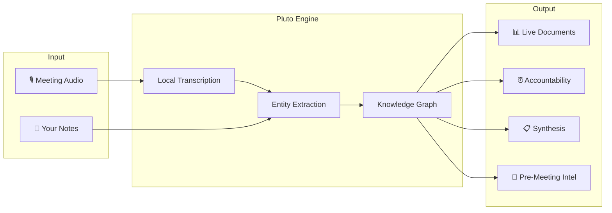
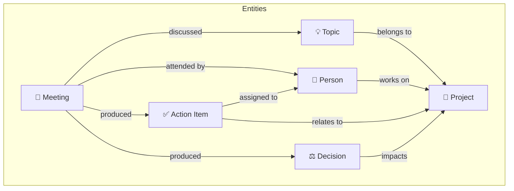
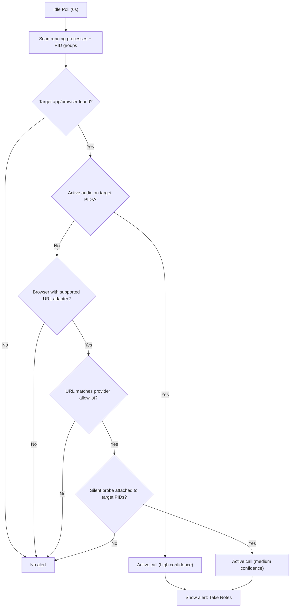
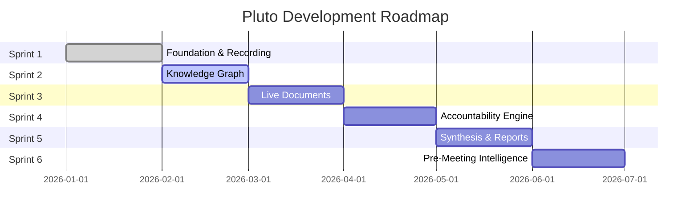

# 📝 Product Requirements Document (PRD)

## Pluto: Your Second Brain for Work

**Version:** 3.2  
**Last Updated:** March 3, 2026  
**Status:** Active Development

---

## 1. Vision

> **"Your meetings are not isolated events. They're connected by people, projects, and themes. Pluto makes those connections visible and useful."**

Pluto is a **local-first, open-source** desktop application that serves as your **second brain for work**. It captures meeting audio, transcribes locally, and builds a knowledge graph of your conversations—connecting people, topics, and action items—while proactively keeping you accountable.

For the broader Knowledge product direction, see [Pluto Second Brain Knowledge Base PRD](./superpowers/specs/2026-04-28-second-brain-knowledge-base-prd.md). That spec defines Knowledge as a general personal second brain surface, not a work-only dashboard: it should include meaningful personal, travel, research, and routine context while ranking and classifying it honestly.

### The Problem

Today's knowledge workers attend 15-25 meetings per week. Each meeting generates insights, decisions, and action items—but this knowledge lives fragmented across:
- Scattered notes in different apps
- Forgotten action items
- Lost context between recurring meetings
- No way to trace how decisions evolved

### The Solution

Pluto transforms meetings from isolated events into an interconnected knowledge system:

---

## 2. Key Differentiators

| Feature | Pluto | Otter.ai | Notion AI |
|---------|-------|----------|-----------|
| **Local-first / Private** | ✅ | ❌ | ❌ |
| **Open Source** | ✅ | ❌ | ❌ |
| **Knowledge Graph** | ✅ | ❌ | ❌ |
| **Live Documents** | ✅ | ❌ | Partial |
| **Proactive Accountability** | ✅ | ❌ | ❌ |
| **Works Offline** | ✅ | ❌ | ❌ |

---

## 3. Core Architecture: The Knowledge Graph

Everything in Pluto connects through a local knowledge graph:

### Entity Types

| Entity | Description | Extracted From |
|--------|-------------|----------------|
| **Meeting** | A recorded conversation | Audio capture |
| **Person** | Someone mentioned or speaking | Diarization + NLP |
| **Topic** | Recurring theme or subject | LLM extraction |
| **Action Item** | Commitment with owner/deadline | LLM extraction |
| **Decision** | Explicit choice made | LLM extraction |
| **Project** | Work stream or initiative | User-defined + inferred |

---

## 4. Target Audience

**Primary:** Knowledge workers attending 10+ meetings per week who want accumulated context without manual overhead.

**Personas:**

| Role | Key Need | Pluto Feature |
|------|----------|---------------|
| **Engineering Manager** | Track team progress across standups | Team Tracker live document |
| **Product Manager** | Find decisions across planning meetings | "Ask Pluto" semantic search |
| **Individual Contributor** | Generate self-review from past work | Quarterly synthesis |
| **Hiring Manager** | Structured interview feedback | Interview templates |

---

## 5. User Stories

### 🧠 Second Brain
- *"I want a system that accumulates context from every meeting so I can focus on the conversation."*
- *"I want a live 'standup tracker' that auto-updates with themes from each standup."*
- *"I want to see all my 1-on-1s with Sarah as a connected timeline."*

### ⏰ Accountability
- *"I want automatic reminders for action items I committed to, with context."*
- *"I want to see stale action items—commitments that haven't been mentioned in a week."*

### 📊 Synthesis
- *"I want to generate my quarterly self-review with one click."*
- *"Before my 1-on-1 with Alex, I want a brief with open items and recent context."*
- *"I want to ask 'What did we decide about the API?' and get answers across all meetings."*

### 🎙️ Core Recording
- *"I want to record any meeting and get an accurate transcript with speaker labels."*
- *"I want all transcription to happen locally—no cloud dependencies."*

---

## 6. Functional Requirements

### 6.1 Audio Capture & Transcription

| Requirement | Details |
|-------------|---------|
| System Audio | AudioCap (CoreAudio process tap) for Zoom/Meet/Teams |
| Microphone | Separate capture for speaker identification |
| Transcription | WhisperX (local, with speaker diarization) |
| Offline | 100% functional without internet |

### 6.2 Knowledge Graph & Entity Extraction

After each transcription, Pluto:

1. **Extracts** entities (people, topics, action items, decisions)
2. **Resolves** entities to existing records ("Sarah" → "Sarah Chen")
3. **Infers** relationships based on co-occurrence
4. **Updates** the graph

| Extraction Type | Example |
|-----------------|---------|
| Person | *"Sarah mentioned..."* → `Person: Sarah` |
| Action Item | *"I'll send the doc by Friday"* → `Action: Send doc, Due: Friday, Owner: You` |
| Decision | *"We decided to use PostgreSQL"* → `Decision: Use PostgreSQL` |
| Topic | *"...the API migration..."* → `Topic: API Migration` |

### 6.2.1 Organization Strategy (Decision)

Pluto uses a **project-first organization model**:
- `Project` entities in the knowledge graph are the canonical way to organize meeting context.
- Pluto does **not** introduce a second taxonomy (separate folder/tag system) for meeting organization.
- Future organization UX should build on project links, saved project views, and project-centric synthesis.

### 6.3 Live Documents

Rolling documents that accumulate knowledge automatically:

| Type | Description | Example |
|------|-------------|---------|
| **Team Tracker** | Summary of team discussions | "Engineering Standups" |
| **Project Space** | All context about a project | "Q1 API Migration" |
| **Person Context** | Everything discussed with someone | "Conversations with Sarah" |

**Behavior:**
- New meeting → relevant documents auto-update
- LLM synthesizes new themes into existing content
- Changes highlighted since last view

### 6.4 Accountability Engine

| Feature | Description |
|---------|-------------|
| **Lifecycle** | Active → Completed / Overdue / Stale |
| **Smart Due Dates** | Extract from "by Friday", "next week" |
| **Staleness** | Flag items not mentioned in 7+ days |
| **Notifications** | macOS native reminders |
| **Dashboard** | "You have 3 pending action items" |

### 6.5 Synthesis & Reports

| Report | Inputs | Output |
|--------|--------|--------|
| **Quarterly Summary** | Date range | Themes, decisions, accomplishments |
| **Self Review** | Date range + prompts | Achievement narrative |
| **1:1 Prep** | Person + meeting | Talking points, open items |
| **Project Report** | Project entity | Timeline, decisions, status |

### 6.6 Pre-Meeting Intelligence

30 minutes before a meeting, Pluto surfaces:
- Last meeting summary with these attendees
- Open action items assigned to them
- Recent relevant decisions
- Suggested talking points

### 6.7 "Ask Pluto" Chat Interface

Query your knowledge graph in natural language:

| Query Example | Response |
|---------------|----------|
| *"What did Sarah say about the timeline?"* | Relevant excerpts with citations |
| *"List action items from this week"* | Grouped by meeting/project |
| *"Summarize my 1-on-1s with Alex"* | Synthesized overview |

### 6.8 Active Call Detection & Alert (Retroactive Update)

Pluto uses a best-effort browser-agnostic model to detect active calls and show a quick note-taking alert.

| Requirement | Details |
|-------------|---------|
| Detection Method | Running-process scan (`ps`) + PID-targeted system-audio probe + browser tab URL adapters where available |
| Browser Coverage | Chrome, Edge, Brave, Safari use URL adapter + audio confirmation; Firefox uses a best-effort URL adapter + audio confirmation |
| Provider URL Allowlist | Google Meet, Zoom, Teams, Slack |
| False-Positive Mitigation | Browser URL match alone does not trigger an alert; audio confirmation is required |
| Supported Apps (Current) | Slack, Zoom, Microsoft Teams, browser-hosted meeting tabs for Meet/Zoom/Teams/Slack |
| Polling Interval | Every 6 seconds while idle (not recording/processing) |
| Alert Window | Separate Electron `BrowserWindow`, always-on-top, 320x80 |
| Alert Behavior | Auto-dismiss after 15s, visible progress bar, timer pauses on hover |
| Primary CTA | **Take Notes** brings Pluto to focus and starts a recording/notes session |
| Dismissal | Hover-revealed close button + auto-timeout |

Slack is included in the provider URL allowlist.

---

## 7. LLM Strategy

| Operation | Provider | Rationale |
|-----------|----------|-----------|
| Entity extraction | Cloud (Gemini) | Speed + structured output quality |
| Document synthesis | Cloud (Gemini) | Long-context handling |
| Quick queries | Local (Ollama) | Privacy for casual "ask Pluto" |

> **Privacy guarantee:** Audio never leaves device. Only text sent to cloud (opt-in).

**Supported Providers:**
- 🏠 **Local:** Ollama (Llama 3.2, Mistral, Phi-3)
- ☁️ **Cloud:** Gemini, OpenAI, Claude (user's API keys)
- 🔌 **Custom:** OpenAI-compatible endpoints

---

## 8. Privacy & Security

| Principle | Implementation |
|-----------|----------------|
| **Local-First** | Works 100% offline |
| **Audio Sovereignty** | Transcription always local |
| **Cloud Opt-In** | Explicit choice; text-only |
| **No Telemetry** | Zero usage data collection |
| **Data Ownership** | SQLite + files, fully accessible |
| **Secure Keys** | OS Keychain via Electron safeStorage |

---

## 9. Roadmap

### Sprint Details

| Sprint | Focus | Key Deliverables |
|--------|-------|------------------|
| **1** | Foundation | WhisperX, reliable recording, basic UI |
| **2** | Knowledge Graph | Entity extraction, resolution, graph storage, active-call detection + quick note alert |
| **3** | Live Documents | Team Tracker, auto-synthesis, export |
| **4** | Accountability | Action item lifecycle, notifications |
| **5** | Synthesis | Quarterly summaries, self-review, "Ask Pluto" |
| **6** | Pre-Meeting Intel | Calendar integration, context cards |

---

## 10. Success Metrics

| Metric | Target |
|--------|--------|
| Time saved per meeting | 10+ minutes vs. manual |
| Query-to-answer time | < 10 seconds |
| Action item follow-through | 80%+ completed on time |
| Weekly active retention | 70% after 30 days |

---

## 11. Open Questions

1. **Action Item Completion:** Explicit "complete" button or infer from meetings?
2. **Calendar Priority:** Integrate early (Sprint 2) or wait for Sprint 6?

---

## Appendix: Competitive Positioning

**Pluto's Position:** The proactive second brain for work—combining automatic knowledge extraction with privacy and accountability.

| vs. Otter.ai | Complete privacy, no subscription |
| vs. Notion AI | Standalone, proactive accountability |
| vs. Roam/Obsidian | Automatic extraction from voice |
