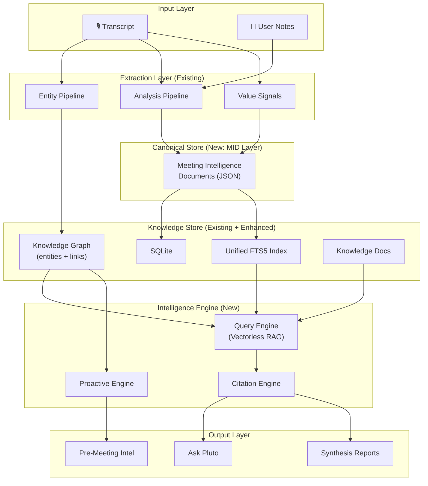
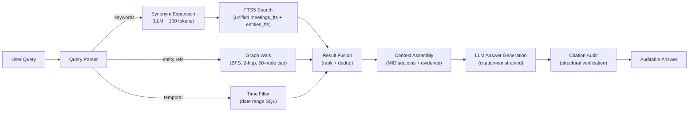

# Pluto Intelligence System — Final Implementation Plan

## Goal

Transform Pluto into a full-stack intelligence system where every user-facing claim is auditable, retrieval is vectorless (FTS5 + graph traversal + LLM synonym expansion), and the canonical truth lives in deterministic structured data per meeting.

> [!IMPORTANT]
> This plan supersedes [implementation_plan_v2.md](file:///Users/metagrover/Desktop/pluto/docs/implementation_plan_v2.md). Key changes from the original:
> - Single unified FTS5 index (no separate `mid_fts` table)
> - Structured JSON frontmatter instead of YAML, Markdown body generated on-demand
> - LLM synonym expansion in query parser for semantic recall
> - Structural citation audit (no second LLM verification call)
> - Phases 3 & 4 swapped (Ask Pluto UI ships before Proactive Engine)
> - Reuses [knowledgeSynthesis.ts](file:///Users/metagrover/Desktop/pluto/electron/knowledgeSynthesis.ts) patterns where possible

---

## System Architecture



---

## Phase 1: Meeting Intelligence Documents (MID Layer)

### What

Replace opaque `enhanced_notes` text blobs with **structured JSON frontmatter** as the canonical intelligence output per meeting. The Markdown body is a rendering concern — generated on-demand from structured data, not stored.

### Data Model

```typescript
// MID Frontmatter — stored as JSON in meetings.mid_json
interface MidFrontmatter {
  mid_version: 1;
  meeting_id: string;
  title: string;
  occurred_at: string;           // ISO datetime
  duration_seconds: number;
  participants: Array<{
    entity_id: string;
    name: string;
    role?: string;
  }>;
  projects: Array<{
    entity_id: string;
    name: string;
  }>;
  topics: Array<{
    entity_id: string;
    name: string;
    importance: 'high' | 'medium' | 'low';
  }>;
  action_items: Array<{
    entity_id: string;
    description: string;
    assignee?: string;
    due_date?: string;
    status: 'active' | 'completed';
  }>;
  decisions: Array<{
    entity_id: string;
    description: string;
    rationale?: string;
  }>;
  signals: {
    continuity: string[];
    accountability_risks: string[];
    decision_impacts: string[];
  };
  evidence_spans: Array<{
    span_id: string;
    claim_type: 'summary' | 'decision' | 'action_item' | 'key_point';
    transcript_range: [number, number];  // segment indices
    quote: string;
  }>;
}
```

### Proposed Changes

---

#### Meeting Intelligence Document Generator

##### [NEW] [midGenerator.ts](file:///Users/metagrover/Desktop/pluto/electron/intelligence/midGenerator.ts)

- Consumes existing [AnalysisArtifacts](file:///Users/metagrover/Desktop/pluto/electron/llm/unifiedProvider.ts#L148-L197) + entity graph data from `meeting_entities` + [InternalSignalDocument](file:///Users/metagrover/Desktop/pluto/electron/llm/provider.ts#43-50)
- Produces `MidFrontmatter` JSON object (deterministic — same inputs → same output)
- Resolves entity IDs by matching extracted names against `entities` table
- Maps evidence spans to transcript segment ranges
- Reuses evidence-building patterns from [knowledgeSynthesis.ts](file:///Users/metagrover/Desktop/pluto/electron/knowledgeSynthesis.ts) (specifically [buildMeetingEvidence](file:///Users/metagrover/Desktop/pluto/electron/knowledgeSynthesis.ts#480-557) and [extractAnalysisEvidence](file:///Users/metagrover/Desktop/pluto/electron/knowledgeSynthesis.ts#258-282))

##### [NEW] [midRenderer.ts](file:///Users/metagrover/Desktop/pluto/electron/intelligence/midRenderer.ts)

- `renderMidToMarkdown(frontmatter: MidFrontmatter): string` — on-demand rendering
- Produces the human-readable Markdown (Summary, Key Points, Action Items, Decisions sections)
- Used only for display purposes, never stored

##### [MODIFY] [db.ts](file:///Users/metagrover/Desktop/pluto/electron/db.ts)

Add `mid_json TEXT` column to `meetings` table via additive migration:

```typescript
// Additive migration
if (!meetingColumns.some((col) => col.name === 'mid_json')) {
  db.exec('ALTER TABLE meetings ADD COLUMN mid_json TEXT');
}
```

Extend `meetings_fts` to include MID-derived fields. This requires rebuilding the FTS table:

```sql
-- Migration: rebuild meetings_fts with MID columns
DROP TABLE IF EXISTS meetings_fts;

CREATE VIRTUAL TABLE meetings_fts USING fts5(
  title,
  transcript_text,
  enhanced_notes,
  user_notes,
  mid_participants,     -- "Sarah Chen, Alex Rivera"
  mid_topics,           -- "Timeline Planning, API Migration"
  mid_decisions,        -- "Use GraphQL for new endpoints"
  mid_action_items,     -- "Send API spec to team"
  meeting_id UNINDEXED
);
```

New DB functions:
- `saveMeetingMid(meetingId, midJson)` — stores MID and updates FTS with flattened fields
- `getMeetingMid(meetingId): MidFrontmatter | null` — retrieves and parses

##### [MODIFY] [main.ts](file:///Users/metagrover/Desktop/pluto/electron/main.ts)

- After `EXTRACT_AND_PROCESS_ENTITIES` completes, call MID generator to build frontmatter
- Call `saveMeetingMid()` to persist and index
- New IPC handler: `GET_MEETING_MID` — returns parsed `MidFrontmatter`
- New IPC handler: `GET_MEETING_MID_MARKDOWN` — returns rendered Markdown via `midRenderer`

---

## Phase 2: Vectorless RAG Query Engine

### What

A retrieval engine that answers natural language queries using FTS5 + LLM synonym expansion + graph traversal. Every answer includes a citation chain.

### Retrieval Strategy



### Retrieval Pipeline Steps

1. **Query Parsing** — Extract intent, entity mentions, temporal references, keywords
2. **Synonym Expansion** — Single LLM call (~100 tokens): "Given keywords `[X]`, suggest 3-5 synonyms/related terms" → expands FTS query with OR clauses
3. **Multi-Index Search** — FTS5 queries against `meetings_fts` (with column filters) and `entities_fts`
4. **Graph Walk** — From matched entities, BFS through `entity_links` (max 2 hops, 50-node cap, `state = 'confirmed'` only, `visited` set for cycle protection)
5. **Result Fusion** — Merge & rank: `score = fts_rank * 0.4 + graph_proximity * 0.3 + recency_decay * 0.2 + mention_weight * 0.1` where `recency_decay = 1 / (1 + days_ago * 0.1)`
6. **Context Assembly** — Pull MID frontmatter + evidence spans for top-K results (K=10), respecting 1s time budget for retrieval
7. **LLM Synthesis** — Generate answer with citation constraints (every claim → source meeting + evidence)
8. **Structural Citation Audit** — Verify that each cited `meeting_id` exists, each `evidence_span` references a valid MID, and each entity ID resolves. No second LLM call.

### Proposed Changes

---

#### Query Engine Core

##### [NEW] [queryEngine.ts](file:///Users/metagrover/Desktop/pluto/electron/intelligence/queryEngine.ts)

```typescript
// Core query pipeline
interface ParsedQuery {
  keywords: string[];
  expandedKeywords: string[];  // from synonym expansion
  entityMentions: string[];
  temporalRange: { from?: string; to?: string } | null;
  intent: 'factual' | 'temporal' | 'comparative' | 'exploratory';
}

interface RetrievalResult {
  meeting_id: string;
  mid: MidFrontmatter | null;
  evidence_text: string;
  score: number;
  score_breakdown: {  // debug_scoring mode
    fts_rank: number;
    graph_proximity: number;
    recency_decay: number;
    mention_weight: number;
  };
}

// Functions
parseQuery(text: string): Promise<ParsedQuery>
expandSynonyms(keywords: string[]): Promise<string[]>  // LLM call
retrieveContext(parsed: ParsedQuery): Promise<RetrievalResult[]>
graphWalk(entityId: string, depth: number, visited: Set<string>): Entity[]
```

- Time-budget early exit: 1s for retrieval, 1s for context assembly
- Result fusion with debug logging mode (`PLUTO_DEBUG_SCORING=1`)

##### [NEW] [citationEngine.ts](file:///Users/metagrover/Desktop/pluto/electron/intelligence/citationEngine.ts)

```typescript
interface CitationChain {
  claim: string;
  meeting_id: string;
  meeting_title: string;
  entity_id?: string;
  evidence_span?: string;      // quote from transcript
  evidence_valid: boolean;     // structural audit result
}

buildCitationChain(answer: string, sources: RetrievalResult[]): CitationChain[]
auditCitations(citations: CitationChain[]): CitationChain[]  // structural only
```

- Structural audit checks: meeting exists, entity ID resolves, evidence span present in MID
- No LLM verification call — deterministic and free

##### [NEW] [queryPrompts.ts](file:///Users/metagrover/Desktop/pluto/electron/intelligence/queryPrompts.ts)

- `getSynonymExpansionPrompt(keywords)` — lightweight prompt for query expansion
- `getAskPlutoPrompt(query, context, citationConstraints)` — citation-constrained answer generation
- `getSynthesisPrompt(sources)` — multi-source narrative with inline citations

##### [MODIFY] [db.ts](file:///Users/metagrover/Desktop/pluto/electron/db.ts)

New query functions:
- `searchMeetingsFts(query, options?)` — FTS5 search with column filters and snippet extraction
- `searchEntitiesWithMeetingContext(query)` — entity FTS + meeting context join
- `walkEntityGraph(entityId, depth, filters)` — BFS graph walk with visited set, confirmed-only filter, 50-node cap
- `getTemporalMeetings(range)` — efficient date-range meeting retrieval

New index (partial index for graph walk performance):
```sql
CREATE INDEX IF NOT EXISTS idx_entity_links_confirmed_source
ON entity_links(source_entity_id) WHERE state = 'confirmed';

CREATE INDEX IF NOT EXISTS idx_entity_links_confirmed_target
ON entity_links(target_entity_id) WHERE state = 'confirmed';
```

##### [MODIFY] [main.ts](file:///Users/metagrover/Desktop/pluto/electron/main.ts)

- New IPC handler: `intelligence:query` — Ask Pluto query endpoint
- New IPC handler: `intelligence:query:debug` — same but returns score breakdowns

---

## Phase 3: Ask Pluto UI

> [!TIP]
> Moved ahead of Proactive Engine — this is the highest-ROI user-facing feature.

### Proposed Changes

---

##### [NEW] [AskPluto.tsx](file:///Users/metagrover/Desktop/pluto/src/components/features/AskPluto.tsx)

- Chat-style query interface with streaming response display
- Citation sidebar: clicking a claim highlights its source meeting + evidence span
- Suggested queries based on recent meeting topics (derived from `meetings_fts`)
- Loading state with retrieval progress indicators

##### [NEW] [CitationCard.tsx](file:///Users/metagrover/Desktop/pluto/src/components/features/CitationCard.tsx)

- Renders a single citation: meeting title, date, evidence span excerpt
- Visual indicator for `evidence_valid` status
- Click-through to meeting detail view

##### [MODIFY] [App.tsx](file:///Users/metagrover/Desktop/pluto/src/App.tsx)

- Add Ask Pluto route/tab
- Wire IPC calls to `intelligence:query`

---

## Phase 4: Proactive Intelligence Engine

> [!NOTE]
> Deferred to last phase. Start with post-meeting triggers only — scheduled scans and pre-meeting briefs can follow in a later sprint if value is demonstrated.

### Proposed Changes

---

##### [NEW] [proactiveEngine.ts](file:///Users/metagrover/Desktop/pluto/electron/intelligence/proactiveEngine.ts)

- **Post-meeting triggers only** (MVP scope):
  - Cross-references with previous meetings (same entities/topics via graph walk)
  - New action items overlapping existing ones (fuzzy match via [findSimilarEntity](file:///Users/metagrover/Desktop/pluto/electron/entityPipeline.ts#122-190))
  - Decisions that conflict with prior decisions on same topic
- Uses existing `queryEngine.retrieveContext()` for cross-referencing
- Emits `IntelligenceAlert` notifications via IPC

##### [NEW] [intelligenceTypes.ts](file:///Users/metagrover/Desktop/pluto/electron/intelligence/intelligenceTypes.ts)

Shared types for the entire intelligence module:

```typescript
interface IntelligenceAlert {
  id: string;
  type: 'cross_reference' | 'duplicate_action' | 'decision_conflict' | 'stale_entity';
  severity: 'info' | 'warning';
  title: string;
  detail: string;
  related_meeting_ids: string[];
  related_entity_ids: string[];
  created_at: string;
}
```

##### [MODIFY] [main.ts](file:///Users/metagrover/Desktop/pluto/electron/main.ts)

- Hook proactive engine into post-meeting pipeline (after MID generation)
- New IPC handler: `intelligence:alerts` — fetch recent alerts

---

## File Structure

```
electron/intelligence/          # NEW directory
├── midGenerator.ts             # MID generation from analysis + entities
├── midRenderer.ts              # On-demand MID → Markdown rendering
├── queryEngine.ts              # Vectorless RAG query engine
├── citationEngine.ts           # Citation chain building + structural audit
├── queryPrompts.ts             # LLM prompts for queries + synonym expansion
├── proactiveEngine.ts          # Post-meeting intelligence triggers
└── intelligenceTypes.ts        # Shared types (MidFrontmatter, CitationChain, etc.)

src/components/features/        # NEW components
├── AskPluto.tsx                # Query interface
└── CitationCard.tsx            # Citation renderer
```

---

## Verification Plan

### Automated Tests

All tests run via `pnpm vitest` from project root (vitest config: `tests/**/*.{test,spec}.ts`).

#### MID Generator Tests

- **File**: `tests/unit/midGenerator.test.ts`
- **What**: Given mock [AnalysisArtifacts](file:///Users/metagrover/Desktop/pluto/electron/llm/provider.ts#67-72) + mock entity graph data + [InternalSignalDocument](file:///Users/metagrover/Desktop/pluto/electron/llm/provider.ts#43-50), verify:
  - Output conforms to `MidFrontmatter` schema (all required fields present and typed)
  - Entity IDs reference valid entities from mock data
  - Evidence spans reference valid transcript segment ranges (within bounds)
  - Idempotency: same inputs → identical JSON output
  - Edge case: empty analysis → valid but minimal MID
- **Command**: `pnpm vitest run tests/unit/midGenerator.test.ts`

#### MID Renderer Tests

- **File**: `tests/unit/midRenderer.test.ts`
- **What**: Given a `MidFrontmatter` object, verify rendered Markdown:
  - Contains required sections (Summary, Key Points, Action Items, Decisions)
  - Action items render as checkboxes
  - Empty sections are omitted, not rendered as "None"
- **Command**: `pnpm vitest run tests/unit/midRenderer.test.ts`

#### Query Engine Tests

- **File**: `tests/unit/queryEngine.test.ts`
- **What**: Given mock FTS results + mock graph data, verify:
  - `parseQuery` extracts keywords, entity mentions, temporal ranges
  - `expandSynonyms` returns valid keyword arrays (mocked LLM)
  - Result fusion scoring is correct (verify each factor's contribution)
  - Graph walk respects depth limits and visited set (no cycles)
  - Graph walk filters to `state = 'confirmed'` only
  - Time budget early-exit triggers when elapsed > budget
- **Command**: `pnpm vitest run tests/unit/queryEngine.test.ts`

#### Citation Engine Tests

- **File**: `tests/unit/citationEngine.test.ts`
- **What**: Verify citation chain construction and structural audit:
  - Every claim in a mock answer maps to a source meeting
  - Audit flags missing meeting IDs as `evidence_valid: false`
  - Audit flags non-existent entity IDs as `evidence_valid: false`
  - Valid citations pass audit with `evidence_valid: true`
- **Command**: `pnpm vitest run tests/unit/citationEngine.test.ts`

### Manual Verification

> [!IMPORTANT]
> Manual testing requires the full Electron app running with 3-5+ recorded meetings.

1. **MID Generation**: Record a meeting → check SQLite `meetings.mid_json` column is populated → call `GET_MEETING_MID_MARKDOWN` IPC and verify it returns well-formed Markdown
2. **FTS Search**: In Electron dev console, call `searchMeetingsFts("GraphQL")` → verify it returns meetings where GraphQL was discussed, with relevant snippets
3. **Ask Pluto**: Open Ask Pluto UI → type "What decisions were made about [topic]?" → verify response includes citation cards → click a citation card → verify it navigates to the correct meeting
4. **Synonym Expansion**: Ask "backend rewrite" when meetings reference "API migration" → verify the expanded query finds the relevant meetings

---

## Implementation Order

| Phase | Priority | Dependencies | Effort |
|---|---|---|---|
| **Phase 1**: MID Layer | Sprint 1 | None (builds on existing extraction) | ~3-4 days |
| **Phase 2**: Query Engine | Sprint 2 | Phase 1 (MIDs in DB for retrieval) | ~4-5 days |
| **Phase 3**: Ask Pluto UI | Sprint 3 | Phase 2 (query engine for answers) | ~3-4 days |
| **Phase 4**: Proactive Engine | Sprint 4 | Phase 2 (query engine for cross-ref) | ~3-4 days |

> [!TIP]
> Phase 1 is the foundation — once MIDs exist, Phases 2-4 build on top. Phase 3 (Ask Pluto UI) and Phase 4 (Proactive Engine) are independent of each other and can be parallelized if desired.
