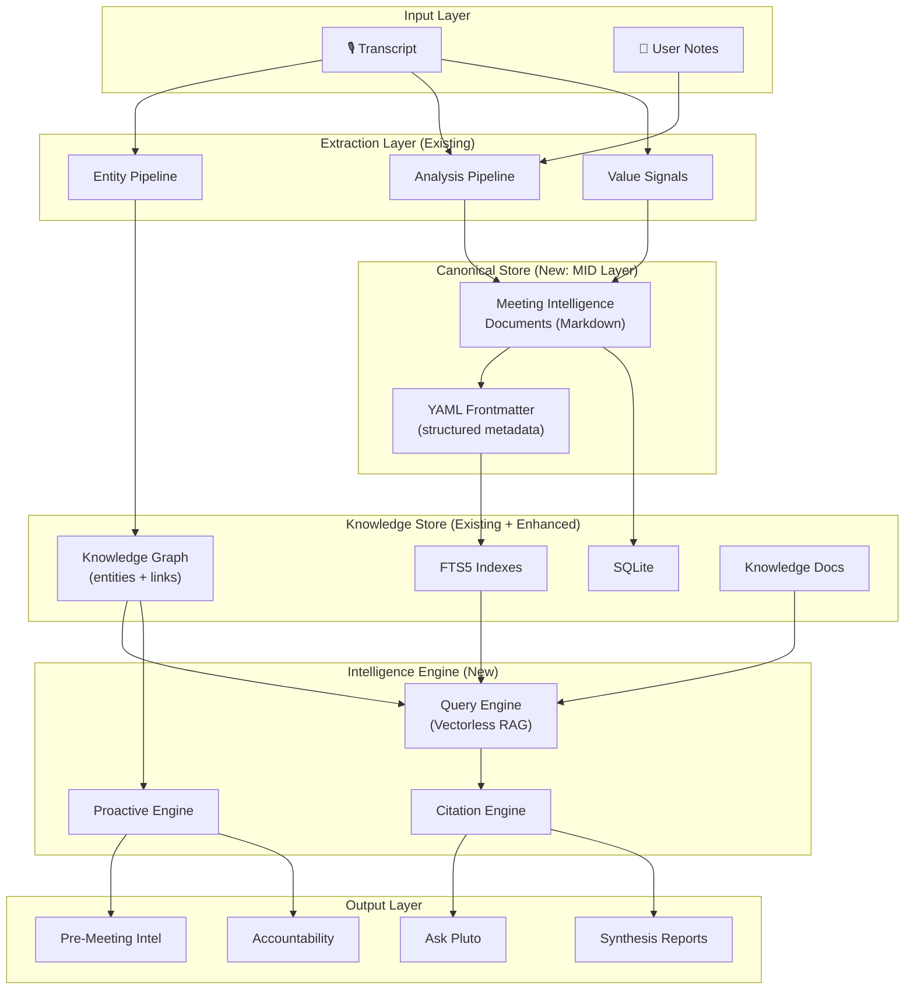
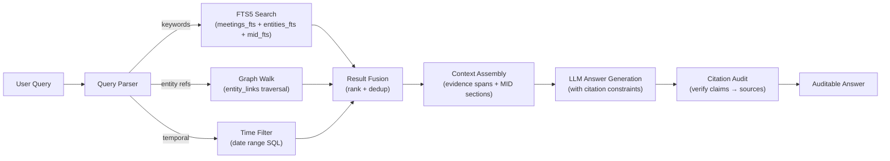
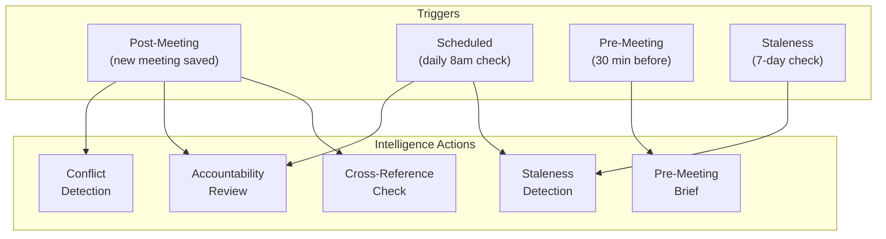

# Pluto Intelligence System — Architecture & Implementation Plan

## Vision

Transform Pluto from a meeting-to-knowledge-graph pipeline into a **full-stack intelligence system** where every user-facing claim is auditable, retrieval is vectorless (FTS5 + graph traversal), and the canonical truth lives in deterministic Markdown.

> [!IMPORTANT]
> This is an **architecture plan** — a blueprint for building out the intelligence system across multiple sprints. It defines the data model, retrieval strategy, query engine, and proactive intelligence layer. Each section maps to new files/modules or targeted modifications to existing code.

---

## Core Principles (Mapped to Architecture)

| Principle | Architectural Response |
|---|---|
| **Canonical Markdown Truth** | Meeting Intelligence Documents (MIDs) — structured Markdown with YAML frontmatter + deterministic body |
| **Vectorless RAG** | FTS5 multi-index + graph-walk retrieval — no embedding models required |
| **Auditable Answers** | Citation chains: every claim → `doc_id` + `node_id` + `meeting_id` + `evidence_span` |
| **Accuracy** | Grounded extraction (existing pipeline) + claim-verification loop |
| **Completeness** | Cross-index fusion: meetings_fts + entities_fts + knowledge_docs + entity_links |
| **Resiliency** | Graceful degradation per layer; SQLite transactions for atomicity |
| **Speed** | Pre-materialized answer fragments; query-time budget with early-exit |
| **Proactiveness** | Event-driven intelligence triggers (post-meeting, pre-meeting, staleness) |

---

## System Architecture



---

## Phase 1: Meeting Intelligence Documents (MID Layer)

### What

Replace opaque `enhanced_notes` text blobs with **deterministic Markdown files** (frontmatter + structured body) as the canonical truth for each meeting's intelligence output.

### Data Model

```yaml
# Example MID frontmatter (stored in meetings.mid_frontmatter JSON column)
---
mid_version: 1
meeting_id: "abc-123"
title: "Sprint Planning Q2"
occurred_at: "2026-03-29T10:00:00-07:00"
duration_seconds: 3600
participants:
  - entity_id: "ent-sarah"
    name: "Sarah Chen"
    role: "Engineering Lead"
  - entity_id: "ent-alex"
    name: "Alex Rivera"
projects:
  - entity_id: "ent-api-migration"
    name: "API Migration"
topics:
  - entity_id: "ent-timeline"
    name: "Timeline Planning"
    importance: high
action_items:
  - entity_id: "ent-ai-1"
    description: "Send API spec to team"
    assignee: "Sarah Chen"
    due_date: "2026-04-04"
    status: active
decisions:
  - entity_id: "ent-dec-1"
    description: "Use GraphQL for new endpoints"
    rationale: "Better type safety and query flexibility"
signals:
  continuity: ["API migration timeline is Q2-critical"]
  accountability_risks: ["No owner assigned for staging deployment"]
  decision_impacts: ["GraphQL choice affects mobile team"]
---
```

```markdown
## Summary
Sprint planning focused on the API migration timeline...

## Key Points
- **Timeline**: Sarah confirmed the migration target is end of Q2...
- **Architecture**: The team decided on GraphQL over REST...

## Action Items
- [ ] Sarah: Send API spec to team by Friday
- [ ] Alex: Set up GraphQL playground by next week

## Decisions
- **GraphQL over REST**: Chosen for type safety and query flexibility

## Evidence Spans
<!-- Machine-readable, hidden in rendered view -->
[span:summary-1]: transcript_segments[12-15] "Sarah said the migration..."
[span:decision-1]: transcript_segments[45-48] "We're going with GraphQL because..."
```

### Proposed Changes

---

#### Meeting Intelligence Document Generator

##### [NEW] [midGenerator.ts](file:///Users/metagrover/Desktop/pluto/electron/intelligence/midGenerator.ts)

- Consumes existing [AnalysisArtifacts](file:///Users/metagrover/Desktop/pluto/electron/llm/unifiedProvider.ts#148-197) + [ExtractedEntities](file:///Users/metagrover/Desktop/pluto/electron/entityPipeline.ts#277-729) + `InternalSignalDocument`
- Produces deterministic MID (frontmatter YAML + Markdown body + evidence spans)
- Evidence spans map claims to transcript segment ranges
- Idempotent: same inputs → same output (no LLM variance in structure)

##### [NEW] [midParser.ts](file:///Users/metagrover/Desktop/pluto/electron/intelligence/midParser.ts)

- Parses MID back into structured data (frontmatter → typed object, body → sections)
- Used by query engine to extract specific claims + evidence

##### [MODIFY] [db.ts](file:///Users/metagrover/Desktop/pluto/electron/db.ts)

- Add `mid_yaml TEXT` column to `meetings` table (stores serialized YAML frontmatter)
- Add `mid_body TEXT` column to `meetings` table (stores Markdown body)
- Extend `meetings_fts` to index `mid_body` content
- New FTS5 table: `mid_fts` indexing frontmatter fields (participants, topics, projects, decisions)

##### [MODIFY] [main.ts](file:///Users/metagrover/Desktop/pluto/electron/main.ts)

- After [generateAnalysisArtifacts](file:///Users/metagrover/Desktop/pluto/electron/llm/unifiedProvider.ts#148-197) + [extractAndProcessEntities](file:///Users/metagrover/Desktop/pluto/electron/entityPipeline.ts#730-758), call MID generator
- Store MID in new columns
- Update FTS indexes

---

## Phase 2: Vectorless RAG Query Engine

### What

A retrieval engine that answers natural language queries using FTS5 + graph traversal instead of vector embeddings. Every answer includes a full citation chain.

### Retrieval Strategy



### Retrieval Pipeline Steps

1. **Query Parsing** — Extract intent, entity mentions, temporal references, keywords
2. **Multi-Index Search** — Hit FTS5 indexes in parallel: `meetings_fts`, `entities_fts`, `mid_fts`
3. **Graph Walk** — From matched entities, traverse `entity_links` (1-2 hops) for related context
4. **Result Fusion** — Merge & rank by: FTS5 rank + graph proximity + recency + mention_count
5. **Context Assembly** — Pull MID sections + evidence spans for top-K results
6. **LLM Synthesis** — Generate answer with citation constraints (every claim → source)
7. **Citation Audit** — Post-hoc verification that cited evidence supports the claim

### Proposed Changes

---

#### Query Engine Core

##### [NEW] [queryEngine.ts](file:///Users/metagrover/Desktop/pluto/electron/intelligence/queryEngine.ts)

- `parseQuery(text)` → `{ keywords, entityMentions, temporalRange, intent }`
- `retrieveContext(parsed)` → ranked, deduplicated evidence fragments
- Multi-index fan-out (FTS5 parallel queries)
- Graph walk with configurable hop depth (default 2)
- Time-budget early exit (default 2s)
- Result fusion scoring: `score = fts_rank * 0.4 + graph_proximity * 0.3 + recency * 0.2 + mention_weight * 0.1`

##### [NEW] [citationEngine.ts](file:///Users/metagrover/Desktop/pluto/electron/intelligence/citationEngine.ts)

- Citation chain type: `{ claim: string, doc_id: string, node_id?: string, meeting_id: string, evidence_span?: string }`
- `buildCitationChain(answer, sources)` → citations attached to each claim
- `auditCitations(answer, citations)` → verification pass (does evidence support claim?)

##### [NEW] [queryPrompts.ts](file:///Users/metagrover/Desktop/pluto/electron/intelligence/queryPrompts.ts)

- Ask Pluto prompt: citation-constrained answer generation
- Synthesis prompt: multi-source narrative with inline citations
- Prep prompt: pre-meeting brief generation

##### [MODIFY] [db.ts](file:///Users/metagrover/Desktop/pluto/electron/db.ts)

- `searchMeetingsMid(query, options)` — FTS5 search across MID content with snippet extraction
- `searchEntitiesWithContext(query)` — entity FTS + meeting context join
- `walkEntityGraph(entityId, depth, filters)` — BFS/DFS graph walk with relationship filtering
- `getTemporalMeetings(range)` — efficient date-range meeting retrieval

##### [MODIFY] [main.ts](file:///Users/metagrover/Desktop/pluto/electron/main.ts)

- New IPC handler: `intelligence:query` for Ask Pluto
- New IPC handler: `intelligence:prep` for pre-meeting briefs

---

## Phase 3: Proactive Intelligence Engine

### What

Event-driven intelligence that surfaces insights without being asked. Triggers on post-meeting processing, scheduled intervals, and staleness detection.

### Trigger Model



### Proposed Changes

---

#### Proactive Intelligence

##### [NEW] [proactiveEngine.ts](file:///Users/metagrover/Desktop/pluto/electron/intelligence/proactiveEngine.ts)

- **Post-meeting triggers**: After MID generation, check for:
  - Cross-references with previous meetings (same entities/topics)
  - New action items overlapping existing ones (potential duplicates)
  - Decisions that conflict with prior decisions on same topic
- **Staleness detection**: Periodic scan of entities/action items not mentioned in 7+ days
- **Accountability review**: Action items approaching due date without completion signal
- **Pre-meeting brief**: Given upcoming meeting attendees, generate contextual prep card

##### [NEW] [intelligenceTypes.ts](file:///Users/metagrover/Desktop/pluto/electron/intelligence/intelligenceTypes.ts)

- Shared types for MID, citation chains, query results, intelligence alerts
- `IntelligenceAlert` type for proactive notifications

##### [MODIFY] [main.ts](file:///Users/metagrover/Desktop/pluto/electron/main.ts)

- Hook proactive engine into post-meeting pipeline
- Register scheduled trigger (if Electron is running)

---

## Phase 4: Ask Pluto UI

### Proposed Changes

##### [NEW] [AskPluto.tsx](file:///Users/metagrover/Desktop/pluto/src/components/features/AskPluto.tsx)

- Chat-style query interface
- Citation sidebar: clicking a claim highlights its source meeting/evidence
- Suggested queries based on recent activity

##### [NEW] [CitationCard.tsx](file:///Users/metagrover/Desktop/pluto/src/components/features/CitationCard.tsx)

- Renders a single citation: meeting title, date, evidence span excerpt
- Click-through to meeting detail view

##### [MODIFY] [App.tsx](file:///Users/metagrover/Desktop/pluto/src/App.tsx)

- Add Ask Pluto route/tab
- Wire IPC calls to intelligence:query

---

## File Structure

```
electron/intelligence/          # NEW directory
├── midGenerator.ts             # MID generation from analysis artifacts
├── midParser.ts                # MID parsing back to structured data
├── queryEngine.ts              # Vectorless RAG query engine
├── citationEngine.ts           # Citation chain building + audit
├── queryPrompts.ts             # LLM prompts for intelligence queries
├── proactiveEngine.ts          # Event-driven intelligence triggers
└── intelligenceTypes.ts        # Shared types

src/components/features/        # NEW components
├── AskPluto.tsx                # Query interface
└── CitationCard.tsx            # Citation renderer
```

---

## Verification Plan

### Automated Tests

All tests run via `pnpm vitest` from project root.

#### MID Generator Tests
- **File**: `tests/unit/midGenerator.test.ts`
- **What**: Given mock [AnalysisArtifacts](file:///Users/metagrover/Desktop/pluto/electron/llm/unifiedProvider.ts#148-197) + [ExtractedEntities](file:///Users/metagrover/Desktop/pluto/electron/entityPipeline.ts#277-729) + `InternalSignalDocument`, verify:
  - Frontmatter YAML is valid and contains all entity references
  - Markdown body has required sections (Summary, Key Points, Action Items, Decisions)
  - Evidence spans reference valid transcript segment ranges
  - Idempotency: same inputs → identical output
- **Command**: `pnpm vitest run tests/unit/midGenerator.test.ts`

#### MID Parser Tests
- **File**: `tests/unit/midParser.test.ts`
- **What**: Roundtrip: generate MID → parse MID → verify structured data matches input
- **Command**: `pnpm vitest run tests/unit/midParser.test.ts`

#### Query Engine Tests
- **File**: `tests/unit/queryEngine.test.ts`
- **What**: Given mock FTS results + graph data, verify:
  - Query parsing extracts keywords, entities, temporal ranges
  - Result fusion scoring is correct
  - Citations are properly attached
  - Time budget early-exit works
- **Command**: `pnpm vitest run tests/unit/queryEngine.test.ts`

#### Citation Engine Tests
- **File**: `tests/unit/citationEngine.test.ts`
- **What**: Verify citation chain construction and audit:
  - Every claim in a mock answer maps to a source
  - Audit catches unsupported claims
  - Citation format matches spec (doc_id, node_id, meeting_id, evidence_span)
- **Command**: `pnpm vitest run tests/unit/citationEngine.test.ts`

### Manual Verification

> [!NOTE]
> Manual testing requires the full Electron app running with at least 3-5 recorded meetings for meaningful knowledge graph data.

1. **MID Generation**: Record a meeting → verify `mid_yaml` and `mid_body` columns populated in SQLite → open Meeting detail view and confirm structured display
2. **Ask Pluto**: Use the query interface to ask "What decisions were made about [topic]?" → verify response includes citation cards pointing to correct meetings
3. **Citation Audit**: Click a citation card → verify it navigates to the correct meeting at the correct evidence span

---

## Implementation Order

| Phase | Sprint | Dependencies | Effort |
|---|---|---|---|
| **Phase 1**: MID Layer | 1 | None (builds on existing extraction) | ~3-4 days |
| **Phase 2**: Query Engine | 2 | Phase 1 (MIDs in DB for retrieval) | ~4-5 days |
| **Phase 3**: Proactive Engine | 3 | Phase 2 (query engine for cross-ref) | ~3-4 days |
| **Phase 4**: Ask Pluto UI | 3-4 | Phase 2 (query engine for answers) | ~3-4 days |

> [!TIP]
> Phase 1 is the foundation — once MIDs exist, Phases 2-4 can be partially parallelized. The query engine and proactive engine are independent of each other.
