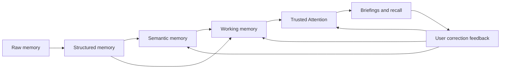

# Cognitive Memory Spine Design

## Status

Accepted for roadmap alignment.

## Source

- [Issue #76](https://github.com/metagrover/pluto/issues/76)
- [Issue #65](https://github.com/metagrover/pluto/issues/65)
- `electron/db.ts`
- `electron/entityPipeline.ts`
- `electron/knowledgeV2.ts`
- `electron/knowledgeSynthesis.ts`
- `electron/intelligence/queryEngine.ts`
- `electron/intelligence/proactiveEngine.ts`

## Goal

Define the shared product and technical model that turns captured context into trusted working memory and prioritized attention without pretending Pluto is already a full multi-agent platform.

## Decision Summary

Pluto's near-term architecture is a Cognitive Memory Spine:

1. Raw capture is stored locally and durably.
2. Structured extraction turns captures into entities, links, and meeting-level metadata.
3. Semantic memory synthesizes cross-meeting reads, streams, and evidence-backed context.
4. Working memory becomes the currently active operational brief Pluto can share across surfaces.
5. Trusted Attention is a durable queue derived from working memory and explicit lifecycle signals.
6. Corrections feed back into future synthesis and ranking.

The spine is the product architecture Pluto should implement next. The previously discussed 10-agent architecture is a later modularization path, not the current milestone.

## Non-Goals

- Do not rewrite Pluto around agents in this phase.
- Do not broaden ingestion beyond local-first captured context yet.
- Do not create a generic task-manager taxonomy.
- Do not introduce a permanent streams table before Phase 2 proves the need.
- Do not treat daily briefs as an independent summarization pipeline detached from attention and working memory.

## Canonical Terms

### Raw memory

Raw memory is the durable local record of what Pluto captured before higher-order interpretation.

Current implementation:

- `meetings`
- `meetings_fts`
- transcript JSON
- enhanced notes
- user notes
- analysis JSON and MID JSON

Raw memory is append-oriented. It preserves original artifacts, timestamps, capture metadata, and fallback text even when later synthesis changes.

### Structured memory

Structured memory is the deterministic extraction layer Pluto can traverse and query without re-reading every transcript.

Current implementation:

- `entities`
- `entity_links`
- `meeting_entities`
- MID-derived participant/topic/decision/action-item fields in FTS
- entity-resolution logic in `electron/entityPipeline.ts`

Structured memory owns extracted people, topics, projects, decisions, and action items plus their graph links, lifecycle state, and grounded evidence snippets.

### Semantic memory

Semantic memory is Pluto's cross-meeting synthesis layer: the place where raw and structured memory become readable briefs, streams, patterns, and cited summaries.

Current implementation:

- `knowledge_docs`
- `knowledge_doc_versions`
- `knowledge_doc_user_edits`
- `knowledge_doc_notes`
- `knowledge_backlinks`
- Knowledge V2 document schema in `electron/knowledgeV2.ts`
- synthesis orchestration in `electron/knowledgeSynthesis.ts`
- retrieval ranking in `electron/intelligence/queryEngine.ts`

Semantic memory may contain synthesized judgments, but those judgments must preserve evidence paths, freshness, and trust messaging.

### Working memory

Working memory is Pluto's current operational understanding: the small, current state that dashboard, Knowledge, Ask Pluto, and future briefings should share when answering "what is going on right now?"

Phase 0 decision:

- Working memory is a product concept now, not yet a distinct table.
- Until Phase 2, Pluto should derive working memory from semantic memory plus structured lifecycle state.
- `KnowledgeV2Document.current_read`, `active_streams`, and selected evidence-backed items are the nearest current implementation.

Future Phase 2 work may persist working-memory snapshots once multiple surfaces need the same state without re-synthesizing it independently.

### Attention item

An attention item is a durable claim that something deserves user awareness or action now, along with evidence, reason, and lifecycle state.

Phase 0 decision:

- Pluto does not yet have a canonical durable attention queue.
- Current attention-like signals live in Knowledge V2 `needs_attention`, action-item lifecycle state, and proactive alerts.
- Phase 1 must move attention ownership into SQLite and out of the in-memory proactive alert store.

### Evidence

Evidence is the trace Pluto can show for an extracted or synthesized claim.

Current evidence sources:

- meeting citations in Knowledge V2
- `entity_links.evidence_meeting_id`
- `entity_links.evidence_quote`
- meeting snippets in `meeting_entities.context`
- MID and analysis excerpts

Evidence should be referenceable by meeting, quote/snippet, related entities, and capture time whenever possible.

### Confidence

Confidence is Pluto's internal estimate of how strongly a claim is supported.

Current implementation:

- extraction/link confidence in `entity_links.confidence`
- synthesis confidence and evidence mode in `KnowledgeV2EvidenceQuality`

Confidence is not a user promise by itself. It must be paired with evidence path and trust status.

### Freshness

Freshness is how recently a claim was reinforced by real source material.

Current implementation:

- `KnowledgeV2Freshness`
- `last_reinforced_at` in knowledge evidence-quality payloads
- meeting timestamps plus entity updates

Freshness should affect ranking, trust messaging, and whether an item belongs in attention versus reference context.

### Trust status

Trust status is the user-facing explanation of how Pluto wants a claim interpreted.

Phase 0 decision:

- Trust status should normalize around grounded, inferred, weak evidence, stale, synthesis failed, and needs review semantics.
- Issue #57 established the shared trust contract across Knowledge, Dashboard, and Ask Pluto: existing `trust_message`, evidence mode, freshness, and source-quality summaries now flow through those canonical labels and their shared explanations.

### Correction feedback

Correction feedback is durable user input that changes future synthesis, ranking, classification, or source handling.

Current implementation:

- `knowledge_corrections`

Phase 0 decision:

- Correction feedback remains distinct from entity lifecycle state.
- Action completion/overdue state belongs to explicit commitment state.
- Ranking, suppression, stream edits, and classification corrections belong to correction feedback.

## Spine Flow

## Current System Mapping

| Product concern | Current owner | Current files/tables | Phase 0 decision |
| --- | --- | --- | --- |
| Source capture | Raw memory | `meetings`, transcript JSON, notes | Keep durable and local-first. |
| Extracted entities and commitments | Structured memory | `entities`, `entity_links`, `meeting_entities`, `electron/entityPipeline.ts` | Keep as the canonical extracted graph. |
| Cross-meeting readable briefs | Semantic memory | `knowledge_docs`, versions, `electron/knowledgeSynthesis.ts`, `electron/knowledgeV2.ts` | Keep as synthesized read model with evidence and freshness. |
| Ask Pluto retrieval | Structured + semantic memory | `electron/intelligence/queryEngine.ts`, FTS, graph walk | Treat as a consumer of the spine, not its own memory layer. |
| Proactive alerts | Transitional attention signal source | `electron/intelligence/proactiveEngine.ts` | Replace in-memory alert ownership with durable attention storage in Phase 1. |
| Dashboard briefing | Working-memory consumer | dashboard view models plus Knowledge V2 reads | Future dashboard briefing should read from working memory + attention. |
| User corrections | Correction feedback | `knowledge_corrections` | Keep durable and feed future ranking/synthesis. |

## Ownership Decisions

### 1. Streams stay view models for now

Active streams are important product objects, but Pluto should not introduce a dedicated persisted streams table in Phase 0.

Why:

- Current streams are derived from meeting content, entity context, and Knowledge V2 synthesis.
- Premature stream persistence would lock weak heuristics into a schema before working-memory needs are clear.
- `knowledge_corrections` already gives Pluto a place to store user overrides such as rename, merge, split, and pin actions.

Implication:

- Phase 1 and Phase 2 work should treat streams as deterministic view models with durable correction overlays.

### 2. Commitment state and correction feedback are separate

Explicit commitments and tasks should keep their lifecycle state in extracted/action-item state, while user corrections stay in `knowledge_corrections`.

Why:

- Completion, overdue, stale, blocked, and assignment are properties of the commitment itself.
- Promote, demote, reclassify, rename, suppress, and stream-level edits are feedback on how Pluto interprets or surfaces information.

Implication:

- Issue #61 should decide when a user action writes both lifecycle state and correction feedback, but it should not collapse them into one table.

### 3. Attention queue ownership moves to SQLite

Phase 1 must create a canonical durable attention layer owned by SQLite rather than by UI-local state or the in-memory proactive alert store.

Why:

- Attention must survive restarts.
- Attention will be read by multiple surfaces.
- Deterministic deduplication and lifecycle transitions need durable identifiers and timestamps.

Implication:

- `electron/intelligence/proactiveEngine.ts` becomes one signal producer among several, not the owner of surfaced attention.

### 4. Briefings are outputs of attention plus working memory

Daily briefings, dashboard briefings, and re-entry briefs should read from working memory and attention instead of synthesizing directly from raw meetings each time.

Why:

- The product promise is continuity, not isolated summaries.
- Shared upstream state keeps Knowledge, dashboard, Ask Pluto, and future briefings aligned on what is active, stale, uncertain, and important.

### 5. Cloud escalation is a later boundary, not a current dependency

The spine assumes local-first processing and honest uncertainty.

Implication:

- Future cloud escalation policy may exist, but it should be layered on top of this spine rather than embedded into the core memory contract.

## Durable Now vs Derived Now

### Durable now

- Captured meetings and transcripts
- Extracted entities
- Entity links and evidence snippets
- Action-item status and due dates
- Knowledge documents and versions
- User edits and notes
- Knowledge corrections

### Derived now

- Active streams
- Current Read headline
- Needs Attention lists
- Pattern summaries
- Dashboard briefing composition
- Proactive alert ranking
- Ask Pluto retrieval summaries

### Durable later

- Attention queue items
- Working-memory snapshots
- Optional future feedback/ranking history if deterministic scoring needs traceability

## Open Choices That Remain Visible

These are named so later issues make them explicit rather than rediscovering them mid-implementation:

1. When Phase 2 persists working memory, should snapshots be full documents, normalized tables, or both?
2. When Phase 1 creates attention storage, should evidence references point directly to meetings/entities or support a normalized evidence-reference table?
3. What is the smallest durable stream identity Pluto needs once working memory and attention share the same state?

## Guidance For Phase 1 Issues

- [Issue #77](https://github.com/metagrover/pluto/issues/77) should create the durable attention queue as a new canonical layer between working memory and briefings.
- [Issue #78](https://github.com/metagrover/pluto/issues/78) should treat proactive alerts, Knowledge V2 items, and lifecycle-derived signals as producers into that queue.
- [Issue #79](https://github.com/metagrover/pluto/issues/79) should score attention using evidence quality, freshness, repetition, urgency, and correction feedback.
- [Issue #61](https://github.com/metagrover/pluto/issues/61) should keep commitment lifecycle state distinct from interpretation/ranking feedback while allowing the two to inform each other.

## Acceptance Check

- The model uses Pluto's current tables and files rather than a greenfield rewrite.
- The 10-agent architecture is explicitly deferred.
- Streams, working memory, attention ownership, digest source, and cloud boundaries are named decisions rather than hidden assumptions.
- The Phase 1 attention issues now have a shared vocabulary for attention, evidence, working memory, freshness, trust status, and correction feedback.
