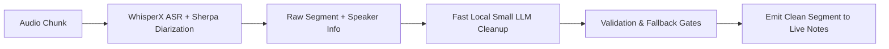

# Real-Time Streaming Chunk Cleanup Pipeline & Auto-Learning Jargon Dictionary

> **Status (2026-08-14): Proposed, not implemented.** The isolated cleanup and auto-learning scaffolding was removed under #622 because it was not connected to the product. #616 owns future transcript validation integration.

**Date:** 2026-08-11
**Status:** Proposed
**Target:** Pluto Desktop (`src/components/AudioManager.tsx` & `python/whisperx_server.py`)

---

## 1. Overview

This specification details two core transcription intelligence enhancements for Pluto inspired by WhimprFlow:
1. **Real-Time Streaming Chunk Cleanup Pipeline**: Extending Pluto's existing `live_chunk_v1` audio pipeline to run fast, low-latency LLM chunk cleanup in real time as live audio streams, removing fillers, fixing spoken self-corrections, and applying spoken punctuation with deterministic hallucination gates.
2. **Auto-Learning Jargon & Vocabulary Dictionary**: Observing user transcript edits inside Pluto notes/documents, filtering out common dictionary words via Zipf frequency scores, and automatically adding learned domain jargon to WhisperX hotwords and LLM system prompts for subsequent recordings.

---

## 2. Real-Time Streaming Chunk Cleanup Pipeline

### 2.1 Architecture & Pipeline Integration
Extends Pluto's existing `live_chunk_v1` arbitration pipeline in `src/components/AudioManager.tsx` and `python/whisperx_server.py`.

### 2.2 Cleanup Transformation Rules
1. **Filler Word Removal**: Strips spoken hesitations (`um`, `uh`, `you know`, `like`, `sort of`).
2. **Self-Correction Resolution**: Collapses spoken backtracks (*"let's meet at 2... no wait, 3pm"* → *"let's meet at 3pm"*).
3. **Spoken Punctuation & Formatting**: Formats spoken directives (`period`, `comma`, `new line`, `bullet point`) into standard punctuation.
4. **Speaker Tag & Timestamp Preservation**: Retains speaker labels (`Speaker 1`) and word alignment boundaries throughout the cleanup pass.

### 2.3 Deterministic Validation & Hallucination Gates
* **Length Ratio Guard**: If `len(cleaned_text) < 0.5 * len(raw_text)` or `len(cleaned_text) > 1.5 * len(raw_text)`, reject cleanup and output raw transcript text.
* **Entity Retention Check**: Ensures numbers, dates, proper nouns, and acronyms present in the raw transcript are retained in the cleaned text.

---

## 3. Auto-Learning Jargon & Vocabulary Dictionary

### 3.1 Edit Observer & Diff Engine (Pluto Knowledge Base Integration)
* Hooks into Pluto's existing document edit system (`knowledge_doc_user_edits` table in `electron/db.ts` and `user_edits_json` in `meetings`).
* When a user inline-edits a meeting note or knowledge document inside Pluto's UI, the diff engine compares the generated `knowledge_doc` text against `knowledge_doc_user_edits.edited_content` to extract `(original_word, corrected_word)` candidates.

### 3.2 Filtering & Qualification
* **Zipf Frequency Filter**: Ignores common English dictionary words (Zipf score $\ge 3.5$).
* **NER & Jargon Qualification**: Qualifies terms that are capitalized, technical acronyms, or non-dictionary proper nouns.

### 3.3 Persistence & Feedback Loop
* Approved terms are saved to Pluto's SQLite database under `personal_dictionary` with `auto_learned = true`.
* Learned terms are injected into WhisperX as `initial_prompt` hotwords and included in the LLM chunk cleanup prompt for subsequent recordings.

---

## 4. Verification Plan

### Automated Tests
* Unit tests for chunk cleanup validation gates (testing fallback on hallucinated/over-edited LLM output).
* Unit tests for the auto-learning Zipf frequency filter and edit diff engine.

### Manual Verification
* Trigger live meeting recording in Pluto and verify real-time filler word removal and self-correction cleanup on live transcript chunks.
* Edit a misspelled domain word in a note, verify it gets added to Settings → Dictionary with an auto-learned tag, and verify it transcribes correctly in the next test recording.
