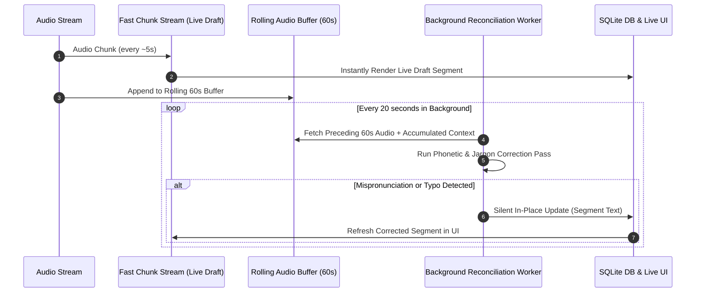

# Real-Time Rolling Context Reconciliation Engine

> **Status (2026-08-14): Proposed, not implemented.** Prior helper scaffolding was removed under #622 after verification showed that it was not wired into the product. Track implementation and acceptance under #616.

## 1. Overview
In live meeting recordings, real-time speech recognition prioritizes ultra-low latency (~5.0x real-time speed using fast small models). However, live draft transcripts can misinterpret proper nouns, technical acronyms, or mispronounced words when context is limited.

The **Real-Time Rolling Context Reconciliation Engine** addresses this by maintaining a 60-second sliding audio buffer during active recording. A non-blocking background worker periodically re-evaluates preceding audio segments using accumulated meeting context (auto-learned jargon terms, participant names, and subsequent sentences). When higher-confidence corrections are identified, transcript segments are updated silently in place, ensuring **zero post-meeting lag** when recording stops.

---

## 2. Architecture & Data Flow

---

## 3. Subsystem Breakdown

### 3.1 Rolling Audio Buffer Queue (`rolling_audio_buffer.py`)
* **Sliding Window**: Holds audio chunks from the last 60 seconds in memory during active recording.
* **Context Snapshot**: Captures current vocabulary terms from `personal_dictionary` and proper nouns from `entities`.
* **Pruning**: Automatically discards audio older than 60 seconds to maintain a minimal memory footprint.

### 3.2 Non-Blocking Background Reconciliation Worker (`rolling_reconciliation_worker.py`)
* **Cadence**: Triggers every 20 seconds on a low-priority thread while recording is active.
* **Phonetic & Context Alignment**: Re-runs Whisper transcription on the buffered 60-second audio window using accumulated `initial_prompt` hotwords.
* **Word Alignment & Levenshtein Diffing**: Aligns word timestamps between the live draft and the reconciliation output. Identifies low-confidence mispronunciations or typos resolved by context.

### 3.3 In-Place Segment Reconciliation & DB Persistence
* **Silent Segment Update**: If a candidate correction improves segment confidence without changing speaker tags or breaking timestamps, `meetings.transcript_json` is updated in place.
* **Zero Post-Meeting Lag**: Because correction happens incrementally during recording, no heavy re-processing is required when recording ends.

---

## 4. Verification Plan

### 4.1 Automated Unit Tests
* **Buffer Queue Tests**: Verify sliding window pruning, size limits, and chunk retrieval (`python/tests/test_rolling_audio_buffer.py`).
* **Reconciliation Worker Tests**: Verify Levenshtein word alignment, low-confidence replacement, and entity preservation (`python/tests/test_rolling_reconciliation_worker.py`).

### 4.2 Replay Benchmark on Recent Pluto Meetings
* Replay the audio recordings from the last few Pluto meetings (`session-mic_*.wav`) through the rolling reconciliation pipeline.
* Measure accuracy improvements, filler/self-correction handling, and execution latency.
